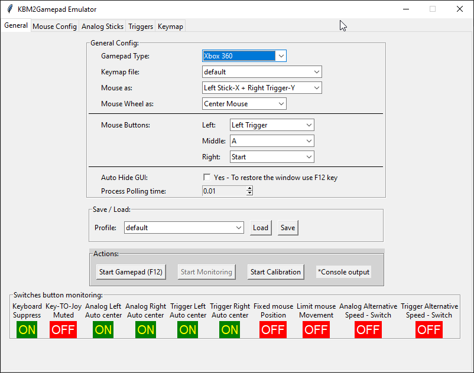
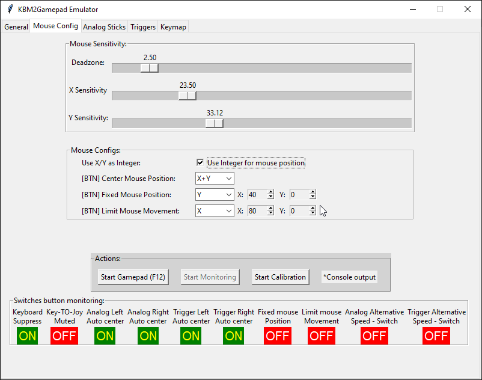
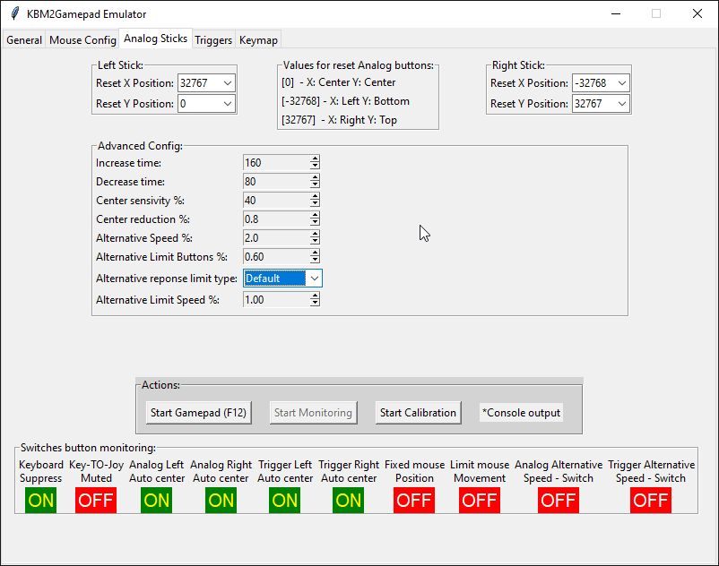
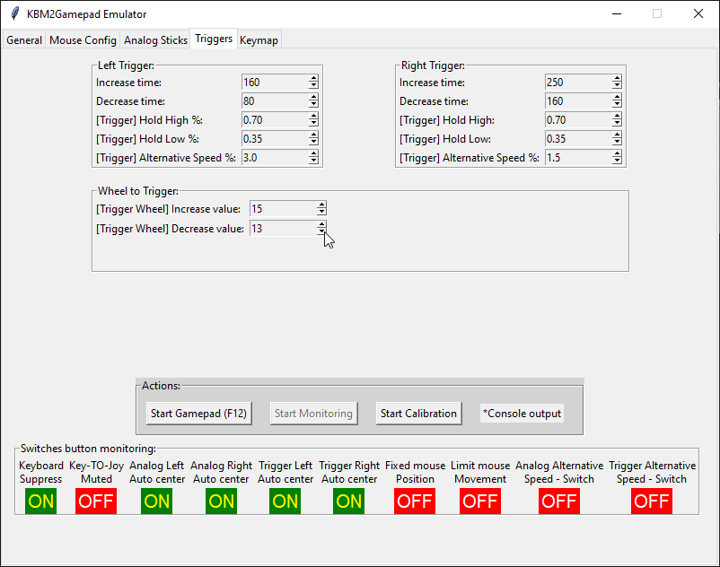
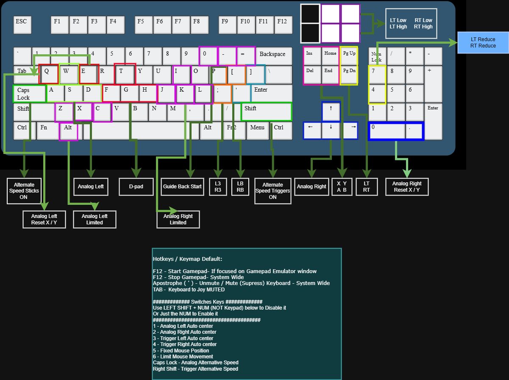

# Requirements
1. Windows 10/11/Server >=2019 
2. Python >= 3.10

# Step 1: 
Install VigemBUS >= 1.20

# Step 2: 
Install python venv on Requirements.txt

# Step 3: 
Run `python gamepad.py`

# Screenshots: 

# Default Keyboard mapping: 

*Mouse settings for trigger or analog stick take precedence over keyboard settings.
E.g.: if you configure the mouse for the right analog stick, the keyboard buttons mapped to the right analog stick will not work.
